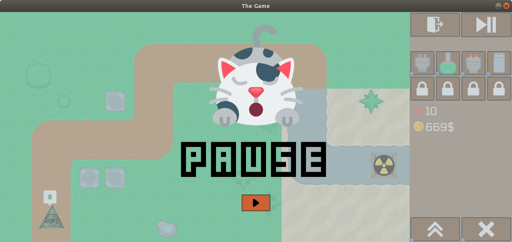
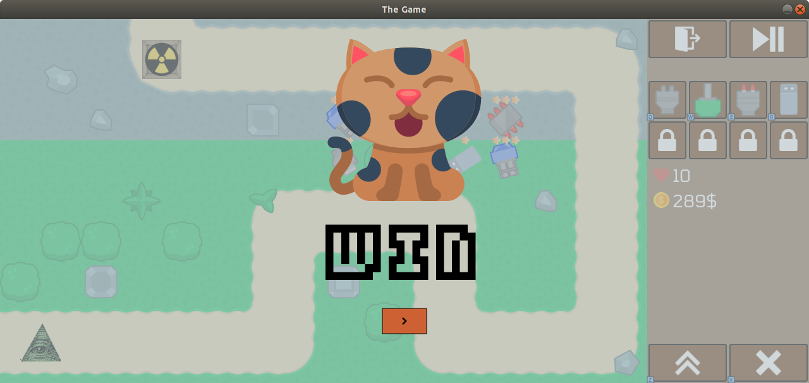

# Tower Defense :gun:

Tower Defense: The Game is a fun project, created by Team Admin a passionate dev team from Ha Noi, Viet Nam. After days of coding and debuging in frustration and rage, sometimes they want to give up, but with the endless passion for coding and the game itself, they have overcome all the difficulties and challenges to finish the game...

Thank you for playing!

## Installation

Just install IntelliJ IDEA, install all dependencies and hit run 🙂

## Demo

## Features

- Tank can move smoothly
- PoC playing through LAN
- Cross platform (thank you Java)
- A lot of stage🎮🎮🎮
- Pause/Resume
- Shortcut
- Bugs

## Screenshots

  

## Authors
- [@HKAB](https://www.github.com/HKAB)
- [@tacbliw](https://www.github.com/tacbliw)
- [@ultoxtung](https://www.github.com/ultoxtung)
- [@thanhminhmr](https://www.github.com/thanhminhmr)

## Buy me a coffee :coffee:

[Patreon](https://www.patreon.com/hkab)